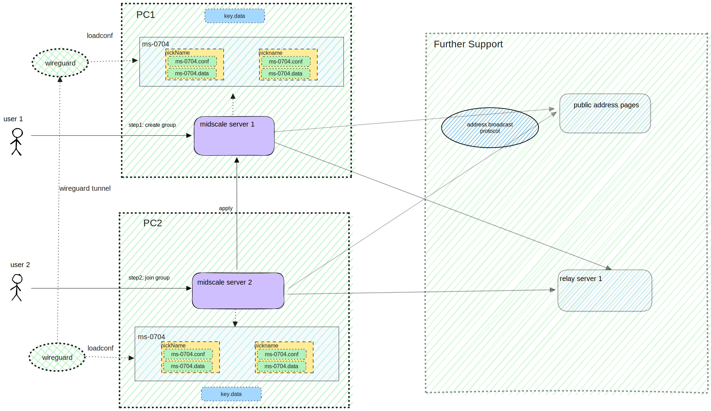

# An open source, self-hosted auxiliary server for wireguard

## What is Midscale

Midscale is a VPN tool used on top of wireguard.

Everything in Midscale is Open Source.

## Design goal

Midscale's goal is to provide a very easy way to start a virtual private network.

## Features

- minimum configuration
- using anytime
- fool-style operation

## OS support

| OS      | Supports Midscale                                         |
| ------- | --------------------------------------------------------- |
| Windows | Yes                                                       |
| Linux   | Comming soon                                              |
| macOS   | Comming soon                                              |
| iOS     | indirectly now                                            |
| Android | indirectly now                                            |

## Architecture



## Running Midscale

### **Notes**

- The use of midscale requires the installation of [Wireguard](https://wireguard.com/install). **Please install the wireguard software yourself before starting to use midscale.**
- If running  `midscale server` with `--autoStartTunnel=true` (this is default), midscale MUST **run as administrator**. And it will generate wireguard conf files and auto start tunnel.
- If running  `midscale server` with `--autoStartTunnel=false` midscale will only generate wireguard conf files (at %appdata%/midscale folder on Windows), you need to import to Official Wireguard client by yourself.
- **Temporarily disable the firewall or open the ports specified by listenAddrForRemote (default is 17979) and listenPort (default is 50501).**

### Execute in PC1 AS a wireguard server

Start midscale using the following command. `192.168.0.115` is the address of the wireguard server endpoint that the clients can access. Please replace `192.168.0.115` with your actual (public) address.

- **run as administrator**

```shell
./midscale.exe server -e="192.168.0.115"
```

Create a group called ms-0704.

```shell
curl.exe -X POST http://localhost:18888/ms/v1/api/group/create -H 'Content-Type: application/json' -d '{\"groupName\": \"ms-0704\", \"joinPassword\":\"8iLf%v\", \"nickName\":\"ms-server\"}'


{"code":0,"message":"OK","results":{"encodedConnectionInfo":"11AzRs3hATs8fNwhF7FcwxweHZxpqkn4aQQ322zHydDZ6D8JZqvFLTFY51riHGWjSEvdzUdRUvDvmWvi7HqAkiawv8yZMSqoDEWETJ6KwPr1E3PtfA4wPggTscbMXj95MUvpxkM339ViR4S68G8J991oWfuQF6XptTbKu3XMXj53xHp8xonapCARaPEMhpw4hKMWwAtfzzeiH6vNE1MwL17Vq8yRAwz3q54FSic9nqzouXomEMerrb6ujX7nZvFWiM5mAaTsjeRM3z2AcpNM9GR5E3habpx5kHW86tXWyHebtax3ZYqqACTmMB9Yp2YB6MKSYQ9DUStro3YpueMJ7Y3ZNToMMHCd9HWTmx9mGAdh2ZDqUDZRQNgLMBqXjTvjim6NUXottWTPH4jvcdzSfopPqEkw5mKqpmY4oWNeCHz1KpLyiycWaiLnF5qbzsNEV6i74cY3pt9T8wMYhFiz4L5KPgdxiaL8Q2M6AxC155"}}
```

https://github.com/midscaleq/midscale/assets/139641468/e15f7699-789a-4ee9-9aa1-54baacf0c157

### Execute in PC2 AS a wireguard client

Start midscale using the following command. The `-e` parameter's value is empty means not to start as a wireguard server endpoint.

- **run as administrator**

```shell
./midscale.exe server -e=""
```

Use encodedConnectionInfo as encodedReq, and group join password joinPassword to join the group.

```shell
curl.exe -X POST http://localhost:18888/ms/v1/api/group/join -H 'Content-Type: application/json' -d '{ \"encodedReq\": \"11AzRs3hATs8fNwhF7FcwxweHZxpqkn4aQQ322zHydDZ6D8JZqvFLTFY51riHGWjSEvdzUdRUvDvmWvi7HqAkiawv8yZMSqoDEWETJ6KwPr1E3PtfA4wPggTscbMXj95MUvpxkM339ViR4S68G8J991oWfuQF6XptTbKu3XMXj53xHp8xonapCARaPEMhpw4hKMWwAtfzzeiH6vNE1MwL17Vq8yRAwz3q54FSic9nqzouXomEMerrb6ujX7nZvFWiM5mAaTsjeRM3z2AcpNM9GR5E3habpx5kHW86tXWyHebtax3ZYqqACTmMB9Yp2YB6MKSYQ9DUStro3YpueMJ7Y3ZNToMMHCd9HWTmx9mGAdh2ZDqUDZRQNgLMBqXjTvjim6NUXottWTPH4jvcdzSfopPqEkw5mKqpmY4oWNeCHz1KpLyiycWaiLnF5qbzsNEV6i74cY3pt9T8wMYhFiz4L5KPgdxiaL8Q2M6AxC155\", \"joinPassword\":\"8iLf%v\", \"joinerNickName\":\"wse3\", \"showConfQR\":false}'


{"code":0,"message":"OK","results":{"serverNickName":"ms-server","serverLocalIP":"10.0.0.1","joinerNickName":"wse3","joinerLocalIP":"10.0.0.2/16"}}

```

https://github.com/midscaleq/midscale/assets/139641468/6df5196c-ca23-4cb5-bfa0-0459210f12d3

### Check if the join is successful

Execute in PC1

```shell
ping 10.0.0.2
```

https://github.com/midscaleq/midscale/assets/139641468/8786fb98-7dc2-487e-871d-2d699f287ebd

Execute in PC2

```shell
ping 10.0.0.1
```

https://github.com/midscaleq/midscale/assets/139641468/961d7abf-885c-4781-8012-b20b8354246b

## Contributing

Midscale is "Open Source, acknowledged contribution", this means that any
contribution will have to be discussed with the Maintainers before being submitted.

This model has been chosen to reduce the risk of burnout by limiting the
maintenance overhead of reviewing and validating third-party code.

Midscale is open to code contributions for bug fixes without discussion.

If you find mistakes in the documentation, please submit a fix to the documentation.

### Requirements

To contribute to Midscale you would need the lastest version of [Go](https://golang.org).

### Code style

To ensure we have some consistency with a growing number of contributions,
this project has adopted linting and style/formatting rules:

The **Go** code is linted with [`golangci-lint`](https://golangci-lint.run) and
formatted with [`golines`](https://github.com/segmentio/golines) (width 88) and
[`gofumpt`](https://github.com/mvdan/gofumpt).
Please configure your editor to run the tools while developing and make sure to
run `make lint` and `make fmt` before committing any code.

## More about using

### start command

```shell
PS C:\> .\midscale.exe server --help
Start a local server and a remote server

Usage:
  midscale server [flags]

Flags:
      --autoStartTunnel              auto install and start wireguard tunnel (optional) (default true)
      --dNS string                   setting of wireguard Interface dns (optional) (default "1.1.1.1, 114.114.114.114, 8.8.8.8")
  -e, --endpointHost string          setting of wireguard peer's endpoint (required)
  -h, --help                         help for server
      --listenAddrForLocal string    listening address and port for local connecting (optional) (default "127.0.0.1:18888")
      --listenAddrForRemote string   listening address and port for client connecting (optional) (default ":17979")
      --listenPort int               setting of wireguard Interface listen port (optional) (default 50501)
      --localIP string               setting of wireguard Interface local ip (optional) (default "10.0.0.1")
      --oneMaskLength int            setting of wireguard Interface local ip one mask length (optional) (default 16)
      --persistentKeepalive int      setting of wireguard peer's persistentKeepalive (optional) (default 30)
      --serverHost string            client sent http request to this host (optional)
  -t, --toggle                       Help message for toggle
```

### interfaces

### create a group

- **run as administrator**

```shell
curl.exe -X POST http://localhost:18888/ms/v1/api/group/create -H 'Content-Type: application/json' -d '{\"groupName\": \"ms-0704\", \"joinPassword\":\"8iLf%v\", \"nickName\":\"ms-server\"}'
```

### join a group

- **run as administrator**

```shell
curl.exe -X POST http://localhost:18888/ms/v1/api/group/join -H 'Content-Type: application/json' -d '{ \"encodedReq\": \"11AzRs3hATs8fNwhF7FcwxweHZxpqkn4aQQ322zHydDZ6D8JZqvFLTFY51riHGWjSEvdzUdRUvDvmWvi7HqAkiawv8yZMSqoDEWETJ6KwPr1E3PtfA4wPggTscbMXj95MUvpxkM339ViR4S68G8J991oWfuQF6XptTbKu3XMXj53xHp8xonapCARaPEMhpw4hKMWwAtfzzeiH6vNE1MwL17Vq8yRAwz3q54FSic9nqzouXomEMerrb6ujX7nZvFWiM5mAaTsjeRM3z2AcpNM9GR5E3habpx5kHW86tXWyHebtax3ZYqqACTmMB9Yp2YB6MKSYQ9DUStro3YpueMJ7Y3ZNToMMHCd9HWTmx9mGAdh2ZDqUDZRQNgLMBqXjTvjim6NUXottWTPH4jvcdzSfopPqEkw5mKqpmY4oWNeCHz1KpLyiycWaiLnF5qbzsNEV6i74cY3pt9T8wMYhFiz4L5KPgdxiaL8Q2M6AxC155\", \"joinPassword\":\"8iLf%v\", \"joinerNickName\":\"wse3\", \"showConfQR\":false}'
```

### get a group info

```shell
curl.exe http://localhost:18888/ms/v1/api/group/info/ms-server
```

### start/stop a tunnel

- **run as administrator**

```shell
curl.exe -X POST http://localhost:18888/ms/v1/api/group/tunnel -H 'Content-Type: application/json' -d '{ \"groupName\": \"ms-0704\", \"nickName\": \"wse3\",\"operation\": \"start\" }'

curl.exe -X POST http://localhost:18888/ms/v1/api/group/tunnel -H 'Content-Type: application/json' -d '{ \"groupName\": \"ms-0704\", \"operation\": \"stop\" }'
```

## Build & Test

```shell
go build
```

## TODO

### leave group(for joinger) 、 delete group(for creator)

### more about principle and usage

### add test code

### add interface to pull all client wireguard confs and group infos from server

### test and then remove related data if apply failed

### accept/reject functions

### mac & linux versions develop

### GUI support

### test IPv4 and IPv6
